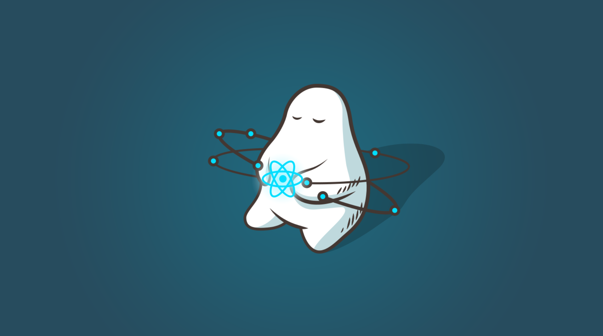
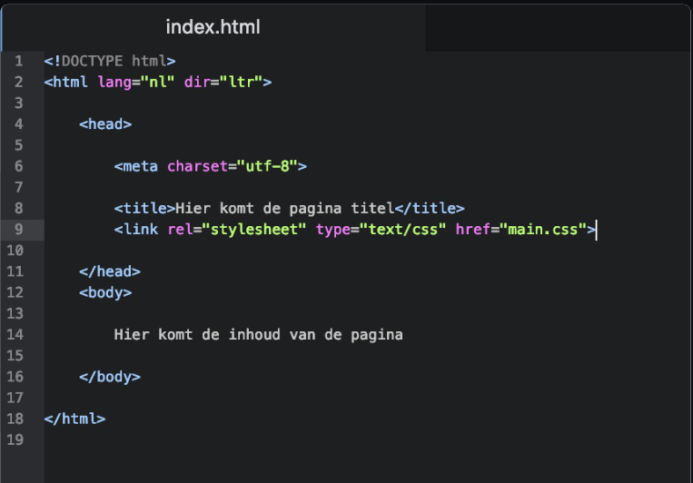

# wat is HTML?

Om te programeren heb je een programeertaal nodig een voorbeeld hiervan is HTML. Maar wat houdt HTML in en hoe gebruik je het?

## Wat houdt het in?
HTML staat voor Hyper Text Markup Language wordt vooral gebruikt voor het schrijven van webpagina's. Met HTML kan je wel een een beetje opmaak voldoen maar daarvoor wordt CSS toch wel het meest gebruikt (Cascading Style Sheet).

## Hoe wordt het gebruikt?

Een HTML pagina begint met een DOCTYPE-declaratie. Deze declaratie laat de browser zien welke standaarden moeten worden ingeladen. Vervolgens krijg je de tag die het HTML document opent, gevolgd door de “head” tag. Binnen deze “head” tag geven we onder andere de titel en de links van de stylesheets door. Vlak onder de “head” komt de “body”. Binnen de “body” komt de gehele opbouw en inhoud van de pagina.

Via HTML maak je de structuur van de website op. Zo verwerk je de afbeeldingen, alinea’s, verschillende koppen,... zodat je later gemakkelijk CSS (opmaaktaal) of javascript (een taal waarbij je webapplicaties kunt ontwikkelen) hierop kunt toepassen.

meer info? (https://www.kopstorm.com/blog/wat-is-html-en-hoe-werkt-het)