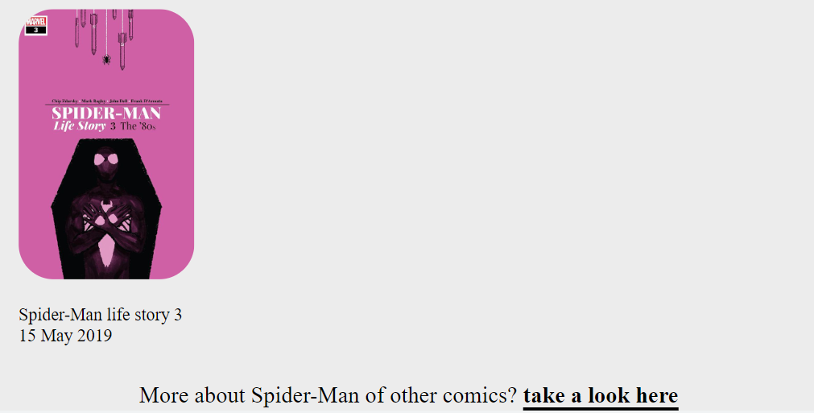

# superhelden website

## een woordje uitleg
Dit was mijn eerste volledige website die ik maakte. Eerst beginnen met markdow dan overzetten naar HTML en CSS. De moeilijkheid van deze opdracht was vooral met het werken van CSS grid. Dit vroeg dan ook erg veel inzicht en meerdere schetsen op papier.